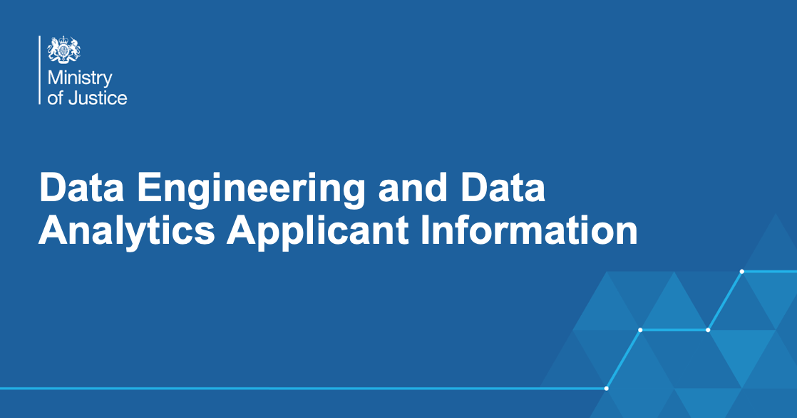

Information for potential applicants for Data Engineering and Analytics Engineers roles within the Data and Analysis division of the Ministry of Justice (MoJ). Here you will find additional information about what work we do.

Last updated: 18th April 2023 by [mshodge](https://github.com/mshodge)

# WE ARE RECRUITING!

We have the current roles open at the moment:

- [Lead Data Engineer (Grade 7)](https://justicejobs.tal.net/vx/lang-en-GB/mobile-0/appcentre-1/brand-15/xf-6c53ece6c921/candidate/so/pm/1/pl/3/opp/73463-73463-Lead-Data-Engineer-Data-Analysis-Ministry-of-Justice-3-roles-available/en-GB)
- [Senior Data Engineer (SEO)](https://justicejobs.tal.net/vx/lang-en-GB/mobile-0/appcentre-1/brand-15/xf-305a998b0ce7/candidate/so/pm/1/pl/3/opp/73530-73530-Senior-Data-Engineer-Data-Analysis-Ministry-of-Justice-2-roles-available/en-GB)
- [Data Engineer (HEO)](https://justicejobs.tal.net/vx/lang-en-GB/mobile-0/appcentre-1/brand-15/xf-b585c4235a17/candidate/so/pm/1/pl/3/opp/73531-73531-Data-Engineer-Data-Analysis-Ministry-of-Justice-1-role-available/en-GB)
- [Lead Analytics Engineer (Grade 7)](https://justicejobs.tal.net/vx/lang-en-GB/mobile-0/appcentre-1/brand-15/xf-ba169ef8396e/candidate/so/pm/1/pl/3/opp/73656-73656-Lead-Analytics-Engineer-Data-Analysis-Ministry-of-Justice-1-role-available/en-GB)
- [Senior Analytics Engineer (SEO)](https://justicejobs.tal.net/vx/lang-en-GB/mobile-0/appcentre-1/brand-15/xf-24a95e4ee51f/candidate/so/pm/1/pl/3/opp/73657-73657-Senior-Analytics-Engineer-Data-Analysis-Ministry-of-Justice-1-role-available/en-GB)

We also will be running a webinar event on Tuesday 25th April 2023 at 18:00 where we will be covering lots of information and taking questions 👉 [sign up here](https://events.teams.microsoft.com/event/1413ee6b-f791-47a7-ad40-e26e1df18f96@c6874728-71e6-41fe-a9e1-2e8c36776ad8)

See below 👇 for more information on these roles and a few generic questions we have answered.

---------

## Who are we

Welcome 👋

Data engineers and analytics engineers within the Ministry of Justice’s Data and Analysis directorate work across two teams, one which delivers solutions to internal stakeholder needs across the organisation, the Data Modelling and Engineering Team (DMET), and another that works on a cutting-edge data platform, the Data Platform Team. We have a section below on what the difference is between the two teams.

As a data engineer or analytics engineer in our teams you will get the opportunity to continue to build your coding skills, as well as develop new and exciting cloud computing capabilities using Amazon Web Service (AWS). We don’t just focus on developing technical skills though. You will also gain experience working directly with stakeholders to deliver important solutions to key Ministry of Justice needs. You won’t be alone either. As well as being part of a growing team within DMET or Data Platform, you will also be part of a large data and analytical community at the Ministry of Justice and use your expertise to shape the future of how data is used in decision making.

### What does a data engineer do?

At all levels, our data engineers design and develop robust data pipelines so that data can be transformed into a form that data scientists and analysts can use. We are also responsible for managing access to data on our [Analytical Platform](https://user-guidance.services.alpha.mojanalytics.xyz/get-started.html). Data engineers will also be expected to directly work alongside key departments within the Ministry of Justice, and be able to explain technical solutions in non-technical ways.

### What does an analytics engineer do?

At all levels, our analytics engineers work with end users of data to understand their requirements, as well as with data suppliers to understand the data sources. They capture business processes, and design conceptual models to provide comprehensive, intuitive, and resilient content to underpin all relevant analytical use cases. They bring an enterprise-wide perspective by working with colleagues to cross-reference requirements across domains, before translating conceptual designs into computer code to deliver facts, dimensions, derived tables and business metadata to end users. They work to ensure data quality is measured and presented to users, and to inform improvement by communicating findings to data owners. They promote content to analytical user communities and gather feedback to shape further development and integration.

---------

## Our structure

### Data Engineering and Modelling Team (DMET)

The Data Modelling and Engineering team works across several areas of the Ministry of Justice to define, design, and deliver Data Engineering and Data Modelling as a service. These areas include [Prison and Probation services](https://www.gov.uk/government/organisations/hm-prison-and-probation-service), [Courts and Tribunal services](https://www.gov.uk/government/organisations/hm-courts-and-tribunals-service), the [Office for Public Guardian](https://www.gov.uk/government/organisations/office-of-the-public-guardian), and MoJ Corporate services. We also have cross-cutting areas such as [Data First](https://www.gov.uk/guidance/ministry-of-justice-data-first) and [BOLD](https://www.gov.uk/government/publications/ministry-of-justice-better-outcomes-through-linked-data-bold) which are Government data-linking programmes we are involved with. Our Data Engineers and Analytics Engineers are supported by a Service Management team who help technical leads engage and work with stakeholders.

### Data Platform

The Data Platform team is responsible for running our existing [Analytical Platform](https://user-guidance.services.alpha.mojanalytics.xyz/), which is used by over 500 analysts and data scientists. We are also at the beginning of our journey to develop a new Data Platform for all of MoJ, built on the principles of Data Mesh, to ensure that everyone, at all levels of the department, has the right data at the right time to make effective decisions that improve justice outcomes.

Data engineers work within multidisciplinary teams alongside technical, product, delivery and user-centred design colleauges to build and maintain platform components that are used by data producers, data users and data consumers to share, find, access, process and manage data. 

For example, we are responsible for:

- [Airflow](https://user-guidance.services.alpha.mojanalytics.xyz/tools/airflow/), which enables people to automate complex data and analytical workflows
- [dbt](https://user-guidance.services.alpha.mojanalytics.xyz/tools/create-a-derived-table/), which enables people to quickly and easily transform and model raw data to make it more useful and useable
- various tools that enable data producers to send us their data in a self-service way, and build standardised pipeline infrastructure

Our work is incredibly varied but has a strong infrastructure focus and involves elements of software development as well as data engineering.

---------

## Our work

### Analytical Platform

The Analytical Platform (AP) provides access to recent versions of open–source analytical software, such as RStudio and JupyterLab, allowing analysts to work in the way that suits them best. Out Data Engineers may be responsible for developing methods of transferring data onto, within and off the Analytical Platform as well as transforming data into a usuable product. Our Data Modellers will understand the data needs of the customer and develop methods to deliver data tables. [Find out more information about the Analytical Platform here](https://user-guidance.services.alpha.mojanalytics.xyz/)

### Analytical Platform Tools

The team has developed a number of Python and R tools, and Web Apps, for users on the Analytical Platform. This includes [pydbtools](https://github.com/moj-analytical-services/pydbtools), which is a package for querying MoJAP athena databases with useful features including temp table creation, and [Create a Derived Table](https://user-guidance.services.alpha.mojanalytics.xyz/tools/create-a-derived-table/), a tool for creating persistent derived tables in Athena.

We continue to develop more tools to make using the Analytical Platform easier for our users, and information on some of these is [available in the Analytical Platform User Guidance](https://user-guidance.services.alpha.mojanalytics.xyz/tools/#python-packages).

### Splink

[splink](https://github.com/moj-analytical-services/splink) is a Python package for probabilistic record linkage (entity resolution). Under its hood it is a PySpark package that implements the Fellegi-Sunter model of record linking, and enables parameters to be estimated using the Expectation Maximisation algorithm. It is used across government for data linking and won several awards over the years. Splink was developed and is maintained by a Data Linking team which sits within the same directorate as and works closely with our Data Engineering teams.

---------

## Questions about our current recruitment

### Where are the roles based?

The roles are national. We have a number of offices around the England and Wales. See this link to find your closest one 👉 [here](https://www.google.com/maps/d/u/0/viewer?mid=1CsJxWFinu4iFbA0Tnq-KrwUAkbvLOZwQ&ll=52.93989869394286%2C-3.20735400000002&z=7)

We're open to flexible and hybrid working arrangements that include regular home working, but you'll need to go to one of these offices from time to time. 

### What is the salary?

The roles on offer are across three different salary bands at the MoJ. But here is a breakdown of the salary ranges:

- Grade 7 👉 National £51,767 - £59,590, London £55,720 - £64,135
- SEO 👉 National £37,683 - £41,506, London £43,647 - £48,067
- HEO 👉 National £31,265 - £34,446, London £35,405 - £39,000

The Data Engineer roles are also entitled to DDaT Allowance, which is added to your base salary:

- Grade 7 👉 maximum allowance of £22,758 
- SEO 👉 maximum allowance of £14,655
- HEO 👉 maximum allowance of £5,273

Your allowance will be calculated based on the skills and experience you demonstrate during the recruitment phases. Whilst in the role you will also have the opportunities to apply for this allowance.

### I am not part of the Civil Service so the terms Grade 7, SEO and HEO confuse me. How do I know what level I should be applying at?

There’s no equation that can translate your skills and experiences directly to a ‘grade’. It depends entirely on your experience and skills, in both a technical and professional capacity. We’re tried to make the skills requirements for each role as easy to understand as possible in the job adverts. In general though, the difference between HEO and Grade 7 is that at Grade 7 you will be managing teams of people, and projects, and have more responsibilities than a HEO.

### What kind of people are you looking for for these roles?

We are really keen to break away from the archetypal views of a Data Engineer and Analytics Engineer. We really encourage anyone with the relevant skills and willingness to learn to apply. We will support you to learn skills you may not yet had the opportunity to learn, but show an eagerness to. 

### Sounds good, but I still have some questions. Where can I ask them?

We’ve setup a mailbox at 👉 dmet-dataplatform-recruitment@digital.justice.gov.uk for any questions. 

And of course, there’s always the webinar too 👉 [sign up here](https://events.teams.microsoft.com/event/1413ee6b-f791-47a7-ad40-e26e1df18f96@c6874728-71e6-41fe-a9e1-2e8c36776ad8)

